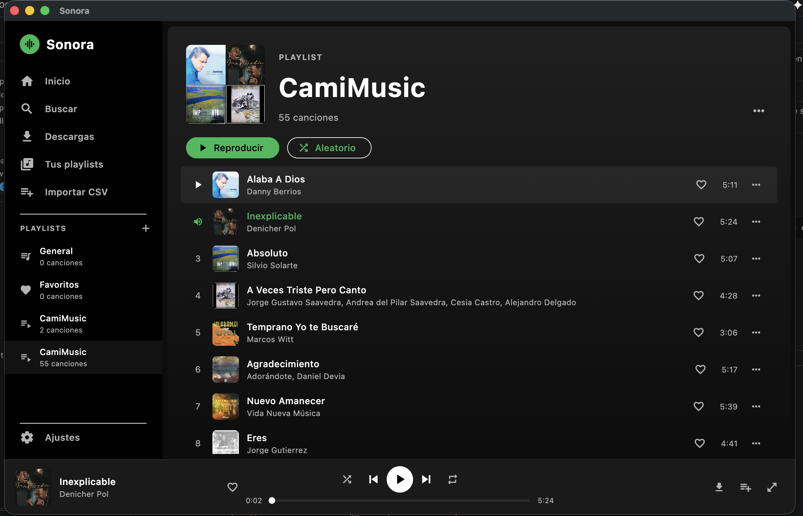

<div align="center">


# Sonora

**A desktop music player** — search, listen and download from YouTube Music,
and import your Spotify playlists with no login and no API.

[](https://lordmacu.github.io/sonora/)
[](https://github.com/lordmacu/sonora/releases/latest)
[](https://flutter.dev)


**🌐 Website: [lordmacu.github.io/sonora](https://lordmacu.github.io/sonora/)**

[⬇️ Downloads](#-downloads) · [✨ Features](#-features) · [🚀 Getting started](#-getting-started)

</div>

---

<div align="center">
  
</div>

---

## ⬇️ Downloads

Grab the latest version for your operating system:

| OS | File | Download |
|--------|---------|----------|
| 🍎 **macOS** | `Sonora-macos.dmg` | [Download](https://github.com/lordmacu/sonora/releases/latest/download/Sonora-macos.dmg) |
| 🪟 **Windows** | `Sonora-windows-setup.exe` | [Download](https://github.com/lordmacu/sonora/releases/latest/download/Sonora-windows-setup.exe) |
| 🐧 **Linux** | `Sonora-linux-x86_64.AppImage` | [Download](https://github.com/lordmacu/sonora/releases/latest/download/Sonora-linux-x86_64.AppImage) |

> 📦 Looking for a specific version? Check all the [releases](https://github.com/lordmacu/sonora/releases).

> ⚠️ **The binaries are not signed** (Apple/Windows code signing isn't paid for yet),
> so your system will show a warning the first time. That's expected — see below how to open them.

### How to open on each platform

<details>
<summary>🍎 <b>macOS</b></summary>

1. Open the `.dmg` and drag **Sonora** into the **Applications** folder.
2. If it says *"cannot be opened because it is from an unidentified developer"*:
   - Right-click the app → **Open** → **Open**, **or**
   - In Terminal: `xattr -dr com.apple.quarantine /Applications/sonora.app`

</details>

<details>
<summary>🪟 <b>Windows</b></summary>

- If *"Windows protected your PC"* (SmartScreen) appears:
  **More info** → **Run anyway**.

</details>

<details>
<summary>🐧 <b>Linux</b></summary>

```bash
chmod +x Sonora-linux-x86_64.AppImage
./Sonora-linux-x86_64.AppImage
```
Works on most distros without installing anything.

</details>

---

## ✨ Features

### 🎵 Playback
- Desktop player powered by **media_kit / libmpv** (native, rock-solid audio).
- Plays **local files**, **YouTube streaming** and **radio**-style queues.
- **Smart queue**: shuffle, previous/next and a radio mode that auto-extends with related tracks.
- **Resume**: remembers playback position and recovers your session after a crash or restart.
- **Expanded full-screen player** with large artwork.
- Always-visible **"Now Playing"** bar with quick controls.

### 🔎 Search & download
- **YouTube Music search** (InnerTube WEB_REMIX) with automatic fallback.
- **Audio downloads** with a progress bar and a **concurrency-limited queue**.
- **Automatic disk caching**: streamed songs are saved as you listen for offline use.
- **Radio / related** tracks from a single song, no AI required.

### 📥 Import your library
- **Import from Spotify with no API and no login** — reads the public JSON from the `embed` page.
  Works even with editorial/algorithmic playlists (`37i9…`) that the official API blocks.
- **Import from CSV** (Exportify / TuneMyMusic format).
- Pick which songs to import and choose **"Add to playlist"** (resolves on YouTube without downloading)
  or **"Download"** to keep them offline.
- If a playlist with the same name already exists, it **reuses the existing one** instead of duplicating it.

### 📁 Playlists & library
- Create, manage and **delete playlists** (with confirmation; protected ones are excluded).
- **Mosaic covers** Spotify-style (1/2/3/4+ images based on the songs).
- **Favorites**, **recently played** and a dedicated **downloads** view.
- Add songs to any playlist from search or your library.

### ⚙️ Settings
- Pick a **local music folder** and scan your audio files.
- Play a whole folder with one click.
- Summary of downloaded songs.

### 🖥️ Desktop
- Cross-platform app: **macOS · Windows · Linux**.
- Native window management (size, controls) via `window_manager`.
- Dark interface inspired by modern music players.

---

## 🚀 Getting started

Just want to use Sonora? Head to [Downloads](#-downloads). To build from source:

### Requirements
- [Flutter](https://docs.flutter.dev/get-started/install) (Dart SDK `^3.10.1`), with desktop support enabled.
- `media_kit` native dependencies for your OS (libmpv on Linux).

### Build & run
```bash
git clone https://github.com/lordmacu/sonora.git
cd sonora
flutter pub get

# Run in development
flutter run -d macos      # or: windows / linux

# Build a release
flutter build macos       # or: windows / linux
```

---

## 🛠️ Stack

| Area | Technology |
|------|-----------|
| UI | Flutter (Material) · `provider` |
| Audio | `media_kit` + `media_kit_libs_audio` (libmpv) |
| YouTube | `youtube_explode_dart` + InnerTube |
| Networking | `http` |
| Storage | `shared_preferences` · `path_provider` |
| Window | `window_manager` |
| Images | `cached_network_image` |

---

## 📄 License

Personal project. Use it at your own risk — Sonora does not host or distribute any
content; it only plays and organizes what the user chooses to search and import.
